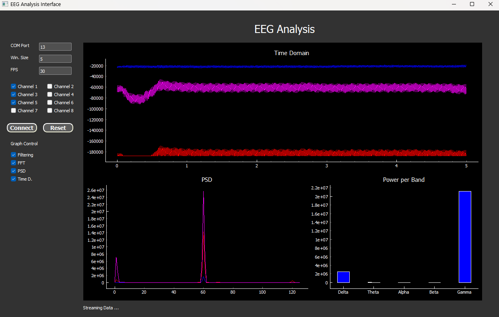

# EEG Analysis Interface

## Overview

The EEG Analysis Interface is a Python-based application developed with PyQt5 and BrainFlow. It is designed to provide real-time data acquisition, visualization, and analysis of EEG signals. The application to connect OpenBCI Cyton board, visualize EEG data in various forms (time domain, frequency domain, power spectral density), and add digital filters.



## Features

- **Device Connection**: Connect to EEG devices using COM port specifications.
- **Real-Time Visualization**: Visualize EEG signals in real-time with options to view in the time domain, frequency domain, and as power spectral density plots.
- **Data Filtering**: Apply digital filters to EEG data to isolate specific frequency bands or remove noise (Add it as you like!).
- **Customizable Settings**: Adjust settings such as window size and update frequency for data acquisition and visualization.

## Installation

1. **Clone the Repository**
   ```
   git clone https://github.com/JuanGonzalezU/OpenBCI_Cyton.git
   ```

2. **Setup Python Environment**
   You will need Python 3.7 or newer. It is recommended to use a virtual environment.
   ```
   conda create -n OpenBCI python=3.8
   ```
   Activate Conda environment
   ```
   conda activate OpenBCI
   ```

3. **Install Dependencies**
   Before running the application, install the required dependencies:
   ```
   pip install -r requirements.txt
   ```

## Running the Application

To run the application, execute the following command in your terminal:
```
python main.py
```
Make sure you are in the application's root directory and your Python environment is activated.

## File Structure

- **`main.py`**: Contains the main application setup, GUI configurations, and event handlers.
- **`functions.py`**: Includes helper functions for interfacing with the EEG hardware (setup and data acquisition), signal processing, and analysis functionalities.

   - `prepare_board(com_port)`: Configures and prepares the EEG board for data acquisition.
   - `compute_fft_welch(eeg_data, fs)`: Computes the Fast Fourier Transform and Power Spectral Density of the EEG data.
   - `compute_power_bands(freqs, psds)`: Calculates power in specified frequency bands.
   - `eeg_filtering(eeg_data, fs)`: Add your own digital filters to EEG data (implementation to be defined).

## Dependencies

The application requires the following main dependencies:
- PyQt5
- pyqtgraph
- numpy
- scipy
- brainflow

These dependencies can be installed using the `requirements.txt` file as mentioned above.

## Note

First test the connection of your Cyton Board with official OpenBCI software. If the connection is stable and succesfull, end the session and run main.py. Also check in which COM port your Cyton Board is connected.

## Contribution

Contributions to the project are welcome. Please ensure to follow the existing code style and add comments where necessary.
